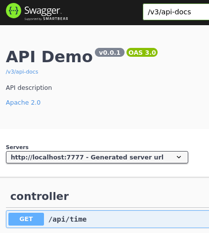

The project was created with https://start.spring.io

## Intention

Use swagger-ui in a spring webflux project.

## Next steps

1. add controller
2. add swagger-ui, access in browser using url http://localhost:7777/swagger-ui.html

3. access api-docs at http://localhost:7777/v3/api-docs
